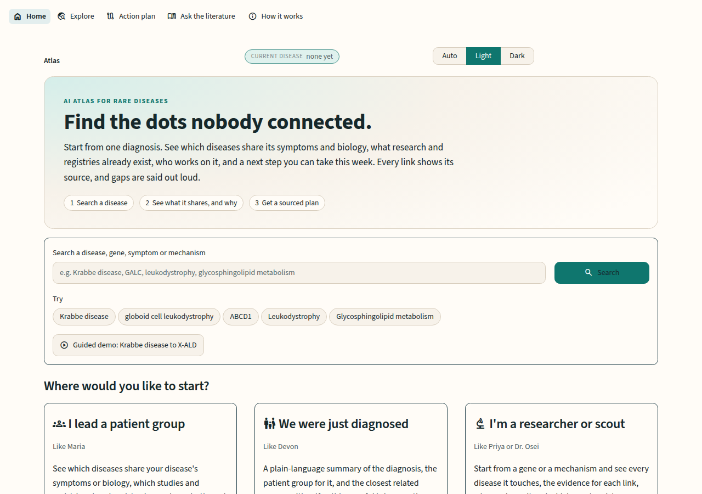
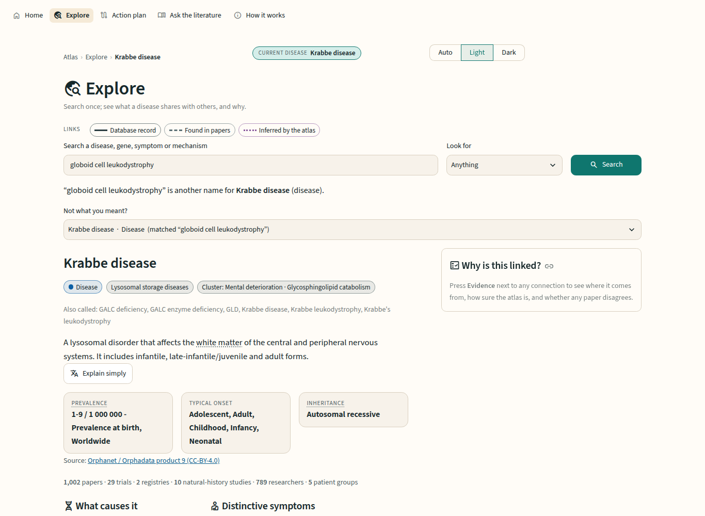
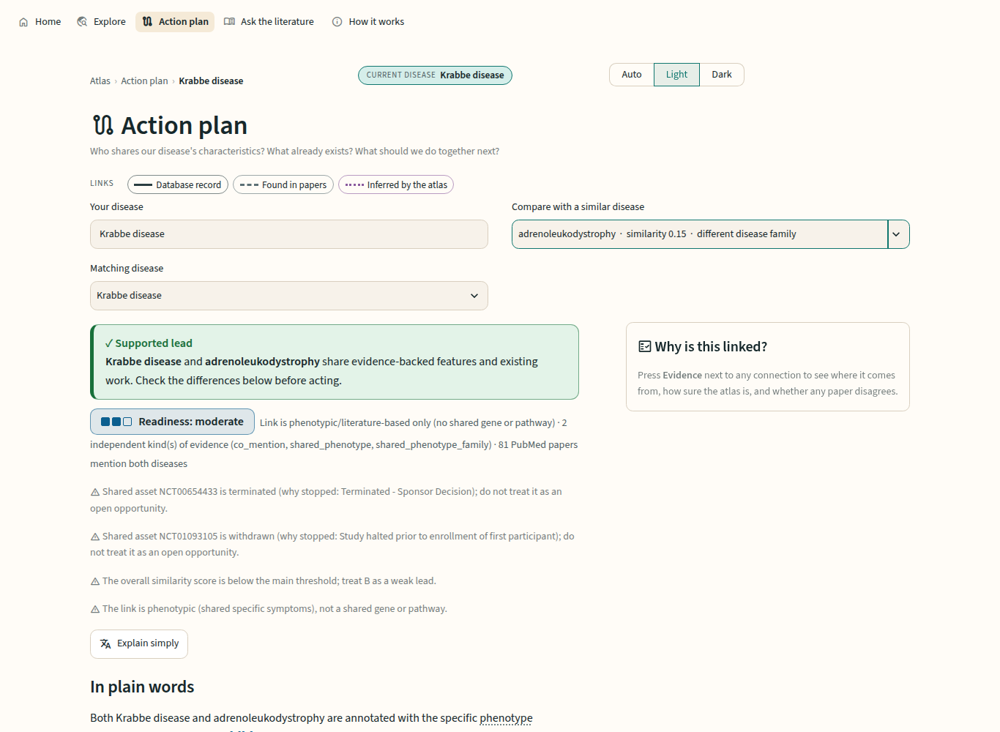

# 🧬 Rare Disease Atlas

**An evidence-graded knowledge graph and decision-support app for rare-disease patient groups, researchers and
therapeutic scouts.** It turns eleven scattered public sources into one graph in which diseases are linked by
**shared mechanism and symptom pattern instead of name**, every edge carries its **source, date, confidence and
evidence type**, and each connection ends in something actionable: a reusable trial or registry, a researcher or
patient group already working on it, and a next step this week, or an explicit gap report when nothing is
supported.

> Built for the **7th Global AI Hackathon, Challenge 05: AI Atlas for the World's Rare Diseases**
> (OpenAI × Buffalo Initiative × Hack-Nation). Everything runs locally on a CPU-only laptop: no GPU, no API keys, no cloud.

**What it does, technically**

- **Ingests** MONDO, HPO, Orphanet, Reactome, ClinVar, PubMed, PubTator3, ClinicalTrials.gov and NIH RePORTER
  (parallel, resumable downloaders) and **resolves** synonyms to one stable ID per disease, gene, symptom and pathway.
- **Builds** a property graph of **60,869 nodes and 207,211 edges** (10 node types) stored as Parquet and served from
  memory with NetworkX; every edge is typed `curated`, `extracted` or `inferred`.
- **Scores** disease–disease similarity from information-content-weighted symptom overlap, shared Reactome pathways
  and literature co-mention, then clusters with Louvain, so a lysosomal and a peroxisomal disease can surface as neighbours.
- **Assesses trust** per edge: a confidence breakdown, an evidence tally and a stance (supported / mixed / weak /
  unsupported), with possible counter-evidence from stopped trials, retractions and conflicting databases.
- **Generates actions**: an action plan with readiness level, shared assets, collaborators, funding gaps, what differs
  between the diseases and a ready-to-send proposal. **Explains** it in plain language with a local 4-bit
  Qwen2.5-3B (llama.cpp); every sentence is citation-checked against the graph facts.
- **Answers questions** over 26,026 PubMed abstracts with hybrid retrieval (bge-small + BM25 + cross-encoder) and a
  grounding gate that refuses when the evidence is too weak.

**Where it is useful**

| If you are… | Use it to… |
|---|---|
| A patient-group leader | find sibling communities, reusable registries and natural-history study designs, and draft a sourced approach to a partner |
| A newly diagnosed caregiver | get a plain-language summary and the patient group for the exact diagnosis, or the closest related ones |
| A biotech / pharma scout | list every disease cluster a mechanism could plausibly reach, with assets, communities and funding status |
| An academic researcher | find who works on the same mechanism under a different disease name, with affiliation and ORCID |

| | |
|---|---|
| **Demo slice** | Lysosomal storage diseases (184) + peroxisomal diseases (89), bridged by leukodystrophy |
| **Evidence** | 26,026 PubMed abstracts · 1,303 clinical studies · 1,779 NIH grants · 85,989 ClinVar records · 12,866 HPO-annotated diseases |
| **Quality** | Retrieval Hit@5 100% on precise questions · 5/5 off-topic and 4/4 unanswerable questions refused · all test suites pass |
| **Runs on** | Any CPU laptop with ~6 GB free RAM; one command to start (`./start`) |

---

## Contents
1. [The problem](#1-the-problem)
2. [Why a new solution is needed](#2-why-a-new-solution-is-needed)
3. [What the atlas does](#3-what-the-atlas-does)
4. [Features](#4-features)
5. [Sample usage](#5-sample-usage)
6. [How it works](#6-how-it-works)
7. [Datasets](#7-datasets)
8. [Technology](#8-technology)
9. [Quick start](#9-quick-start)
10. [Reproduce the dataset](#10-reproduce-the-dataset)
11. [Evaluation](#11-evaluation)
12. [Trust, safety and limits](#12-trust-safety-and-limits)
13. [Repository layout](#13-repository-layout)
14. [Extending the atlas](#14-extending-the-atlas)
15. [Acknowledgements and licences](#15-acknowledgements-and-licences)

---

## 1. The problem

There are **~10,000 known rare diseases**. About 80% are genetic, ~5,000 are caused by a single gene, together
they affect **~350 million people**, and **fewer than 5% have an approved treatment**.

When a child is diagnosed with one of them, the family often learns the name of a gene and nothing about what to
do next. Parents become the organisers of a research effort they never expected to lead: finding other families,
raising money, starting a registry, asking researchers where to begin.

The knowledge they need exists, but it is **scattered**:

| Where it lives | What it holds |
|---|---|
| Disease and gene databases (OMIM, Orphanet, MONDO, HPO, ClinVar) | genes, variants, symptoms, identifiers |
| PubMed | claims, experiments, the researchers behind them |
| ClinicalTrials.gov | trials, registries, natural history studies |
| NIH RePORTER | funded programmes and principal investigators |
| Patient-organisation websites | communities, registries, contacts |

None of these sources talk to each other, and none of them is written for a parent at 2 a.m.

## 2. Why a new solution is needed

**Names hide mechanisms.** Diseases are filed by name and category. Two "unrelated" diseases (different organelle,
different gene, different patient group) can share the same symptom pattern, the same disrupted pathway, the
same transplant protocol, and even the same researchers. Organised by name, those links are invisible.

**Groups rebuild what already exists.** A community may already have a registry, a natural history study design,
an animal model or a trial protocol another group could adapt. You cannot reuse what you cannot find, or judge
whether it applies.

**Search engines and chatbots don't solve it.** Search returns either nothing or dense abstracts. General chatbots
produce fluent answers that may cite things that do not exist, which is unacceptable when a family is deciding
where to put scarce time and money.

**What is needed** is a map that:
- links diseases by **mechanism and symptoms**, not by name;
- shows **where every link comes from** and how sure we are, including evidence that **disagrees**;
- turns links into **something a patient group can do this week**;
- says clearly **when no supported route exists**, and what evidence would change that.

## 3. What the atlas does

The atlas answers the three questions from the brief:

| Question | What the atlas shows |
|---|---|
| **Who shares our disease characteristics?** | Related diseases ranked by rare shared symptoms, shared pathways and papers that mention both, each with a "why" |
| **What useful work already exists?** | Trials, registries, natural history studies, NIH grants, pathogenic variants and disease models, grouped and linked to their source |
| **What should we do together next?** | Researchers and patient groups active on both diseases, what differs and must be checked, a readiness level, next steps and a ready-to-send proposal |

It serves four personas from the brief:

| Persona | Entry point | What they get |
|---|---|---|
| **Maria**, patient-organisation leader | *I lead a patient group* → Action plan | Closest disease clusters, shared assets, partners, a sourced proposal |
| **Devon**, newly diagnosed caregiver | *We were just diagnosed* → Explore | Plain-language summary, their patient group (or the closest related ones), honest gaps |
| **Priya**, biotech scout | *I'm a researcher or scout* → start from a mechanism | Every disease touched by a pathway, with evidence, communities and assets |
| **Dr. Osei**, academic researcher | Collaborators view | Who else works on the same mechanism under a different disease name, with affiliation and ORCID |

## 4. Features

| Feature | How it is delivered |
|---|---|
| **Disease search** | One search box for diseases, genes, symptoms and mechanisms; typo-tolerant |
| **Knowledge graph** | 10 node types, 20+ relationship types, interactive map with click-to-expand |
| **Evidence for every connection** | Each edge stores source, source ID/link, date, confidence and evidence type; an inspector shows all of it beside the connection |
| **Related-disease discovery** | Similarity from rare shared symptoms + shared pathways + literature co-mention; clusters; "different disease family" flag |
| **Research asset discovery** | Trials, registries, natural history studies, NIH grants, ClinVar variants, models; stopped trials show why they stopped |
| **Collaborator discovery** | Ranked researchers (papers, grants, trials) with the reason, affiliation and ORCID; researchers active on *both* diseases |
| **Next-action generation** | Action plan with readiness (strong / moderate / weak / none), next steps that cite their evidence, copy/download proposal |
| **Synonym / entity resolution** | MONDO, HPO, gene and pathway synonyms map to one stable node: "globoid cell leukodystrophy" → Krabbe disease |
| **Confidence + contradiction handling** | Confidence breakdown (reliability × recency + corroboration − penalty); counter-evidence from stopped trials, retracted or negative papers, disagreeing databases; a stance per edge: supported / mixed / weak / unsupported |
| **Patient-friendly explanations** | "Explain simply": a four-part plain summary (*Short answer · What is uncertain · Who can help · This week*), every sentence cited and verified; 70-term glossary on hover |
| **Honest gap reports** | When nothing is supported: what was searched (with counts), what is missing, the next question to ask |
| **Ask the literature** | Natural-language questions over 26k abstracts, answered with PubMed citations or refused |
| **Funding and epidemiology** | NIH funding (active, shared, gaps) and Orphanet prevalence, onset and inheritance |
| **Light / dark / auto theme** | Toggle in the top bar; colour-blind-safe palette; node types differ by shape, evidence types by line style |
| **Guided demo** | One click walks Krabbe → X-ALD through Explore and Action plan |

## 5. Sample usage

All numbers below are real outputs from the current build. The app opens on the home page (light theme shown;
a dark theme and an Auto mode are one click away in the top bar):



### Example 1: Krabbe disease → X-linked adrenoleukodystrophy (a symptom-level lead across disease families)

**Step 1: Search.** Maria types the name her doctor used: `globoid cell leukodystrophy`. The atlas resolves it to
**Krabbe disease** (MONDO:0009499) and says so: *"globoid cell leukodystrophy" is another name for Krabbe disease.*
(`X-ALD` resolves to adrenoleukodystrophy and `GALC` to the gene the same way.)

**Step 2: The disease card, summary first.**

| | |
|---|---|
| What causes it | **GALC**, PSAP (each with its database record) |
| Mechanism | **Glycosphingolipid catabolism** (Reactome) |
| Distinctive symptoms | Hyperpyrexia, reduced galactocerebrosidase activity, abnormal visual evoked potentials, decerebrate rigidity… (34 rare symptoms; 33 common ones folded away) |
| How common | 1–9 per 1,000,000 births, worldwide (Orphanet) |
| Evidence | 1,002 papers · 29 trials · 2 registries · 10 natural history studies · 789 researchers |
| Patient groups | United Leukodystrophy Foundation, European Leukodystrophy Association, Hunter's Hope, KrabbeConnect, Lysosomal Disease Network |

*Example: the disease card for Krabbe disease, reached by searching a synonym (light theme).*



**Step 3: Who shares our characteristics?** Same-family neighbours come first (metachromatic leukodystrophy and
the PSAP-related sphingolipidoses, scores 0.43–0.48, sharing a pathway *and* symptoms). Switching on
*"Only diseases from a different family"* surfaces **adrenoleukodystrophy**, a *peroxisomal* disease: different
organelle, different gene, but shared neurological symptoms. The atlas marks it **weak (0.15)** and dotted,
because it is a computed hypothesis, not an established fact.

**Step 4: Action plan, Krabbe ↔ X-ALD.**

- **Readiness: moderate**, with its reasons: the link is symptom- and literature-based (**no shared gene or
  pathway**), 81 PubMed papers mention both, and 3 shared assets are stopped trials.
- **What already exists:** **15 shared studies**, including transplant trials for inherited metabolic disorders, a
  natural history study, the Krabbe Disease Global Patient Registry and the Myelin Disorders Biorepository.
- **Who works on both:** e.g. Inderjit Singh (12 Krabbe papers, 38 ALD papers) and William Krivit (12 / 13).
- **Patient groups serving both:** European Leukodystrophy Association, United Leukodystrophy Foundation.
- **What must be checked before joining forces:** symptoms and genes unique to each disease, e.g. only Krabbe
  disease is annotated with hyperpyrexia and reduced galactocerebrosidase activity.
- **Next steps** (each linked to its evidence): contact the European Leukodystrophy Association, which serves
  both diseases; ask a researcher who publishes on both; check the eligibility and outcome measures of a recruiting
  trial that studies both.

*Result: the action plan for Krabbe disease vs adrenoleukodystrophy, with the supported-lead banner, readiness badge and caveats (light theme).*



**Step 5: Explain simply** (family level, excerpt; each `[n]` opens the evidence):

> **Short answer:** Yes, the atlas found a supported lead linking Krabbe disease and adrenoleukodystrophy
> (overall similarity score 0.15 on a 0 to 1 scale) [1]. Both are listed as having the symptom
> 'Neurodegeneration' [2][3]. 81 PubMed papers mention both [4][5].
> **What is uncertain:** Shared study NCT00654433 is terminated (sponsor decision); do not treat it as an open
> opportunity [1]. The two diseases belong to different disease families, so this is a lead for researchers to
> check [1]. **Who can help:** European Leukodystrophy Association supports families affected by both [6]…
> **This week:** Contact European Leukodystrophy Association and share this page [6]… This is a research lead,
> not medical advice.

**Step 6: Proposal.** One click copies or downloads a plain-text proposal Maria can send to the partner group,
with the sources listed.

**When there is no supported route** (e.g. acatalasia vs Fabry disease), the plan says so and shows its work:
*searched* HPO (17 and 91 symptoms, 28 shared but all broad, 0 informative), genes (no overlap), pathways (0
shared), PubMed (165 and 3,713 papers, 0 mention both), trials (0 shared); *missing*: a specific shared symptom,
a shared pathway, co-mention papers; *next question* to ask a specialist or patient group.

### Example 2: cerebrotendinous xanthomatosis → AMACR deficiency (a mechanism-level lead)

A contrast to example 1: here the link is **biological**, not just clinical.

1. **Search** `cerebrotendinous xanthomatosis` (CTX), a lipid-storage disease caused by **CYP27A1** (prevalence
   1–9 per 100,000, Orphanet; 61 rare symptoms such as elevated CSF cholestanol).
2. **Similar diseases → "Only diseases from a different family"** lists the *peroxisomal* diseases most like CTX,
   including *alpha-methylacyl-CoA racemase (AMACR) deficiency* at similarity 0.16. This link is **not** flagged
   weak, because it clears the main threshold and its "why" names the shared bile-acid pathway.
3. **Open the Action plan for CTX vs AMACR deficiency.** Readiness is **strong**, for these reasons:
   - *mechanism-level link:* **CYP27A1 and AMACR act in the same Reactome pathway**, "Synthesis of bile acids and
     bile salts" (via 24-hydroxycholesterol and via 7α-hydroxycholesterol), a curated link rather than a text match;
   - two independent kinds of evidence (shared pathway, literature co-mention) and 4 reusable assets: the
     **Myelin Disorders Biorepository Project**, a CTX registry (NCT03047369), a CTX natural-history study
     (NCT05368038) and two newborn-screening programmes (ScreenPlus, Early Check).
4. **What differs and must be checked:** only CTX is annotated with elevated cerebrospinal-fluid cholestanol and
   elevated bile-alcohol levels, so symptoms do not transfer one-to-one.
5. **Patient groups serving both:** European Leukodystrophy Association and United Leukodystrophy Foundation.
6. **Next steps:** share the registry protocol (NCT03047369) and natural-history design (NCT05368038) with the
   AMACR community, and ask whether therapies that act on bile-acid synthesis could apply across both diseases.
7. **Honest gaps the atlas also reports:** only 1 PubMed paper mentions both diseases; no researcher has two or
   more papers on both (so approach each community separately); and **neither disease has an active NIH grant**
   (NIH only; other funders are not covered).

### Example 3: asking the literature and getting refused

- *"Is hematopoietic stem cell transplantation used for X-linked adrenoleukodystrophy?"* → a cited answer drawn
  from 5 abstracts in about 12 s on CPU, with each source openable and linked to PubMed.
- *"What is the best pizza in New York?"* → refused in a few seconds, before any model call.
- *"What is the cost of enzyme replacement therapy in Nigeria?"* → refused: the abstracts do not support an answer.

More than 600 ready-made things to try, for each feature, are listed in [tests/queries.txt](tests/queries.txt).

## 6. How it works

```
 1 COLLECT            2 RESOLVE + CONNECT           3 SCORE + CLUSTER        4 SERVE
 ─────────────        ─────────────────────         ─────────────────        ──────────────────────────────
 MONDO HPO Orphanet ┐                                                         atlas/  (NetworkX, in memory)
 Reactome ClinVar   ┤  one stable ID per entity,                               graph · resolve · actions
 PubMed + PubTator  ┼► synonyms → nodes.parquet  ─► disease similarity  ─┬──►  explain (plain language)
 ClinicalTrials.gov ┤  edges.parquet with source,   (symptoms · pathways │          │
 NIH RePORTER       ┘  date, confidence, type        · literature)       │      atlas/api.py  (one contract)
                                                     Louvain clusters    │          │
 PubMed abstracts ──► embeddings + BM25 index ──────────────────────────┴──►  rag/  cited Q&A
                                                                                    │
                                                                              app/  Streamlit UI
```

**Tables *and* a graph.** Everything is stored as flat Parquet tables (`nodes`, `edges` with provenance
columns), which are easy to inspect, diff and rebuild. At start-up they load into an in-memory NetworkX graph for
what tables do badly: multi-hop paths, community detection, shared-researcher projection and the visual map. No
graph database is needed: the graph loads in ~6 s and a disease card + neighbours returns in < 0.1 s.

**Graph schema.**

| Node | Identifier | Example relationships |
|---|---|---|
| Disease | MONDO | `subclass_of`, `has_phenotype`, `similar_to` |
| Gene | NCBI Gene / HGNC symbol | `causes`, `associated_with`, `in_pathway` |
| Variant | ClinVar VariationID | `variant_of`, `pathogenic_for` |
| Phenotype (symptom) | HPO | (target of `has_phenotype`) |
| Pathway (mechanism) | Reactome | (target of `in_pathway`) |
| Paper | PMID | `mentions`, `cites` |
| Researcher | ORCID or name key | `authored`, `leads`, `investigates` |
| Trial / registry / natural history | NCT | `studies` |
| Grant | NIH project number | `funds` |
| Patient organisation | curated slug | `serves`, `runs` |

| Evidence type | Shown as | Meaning |
|---|---|---|
| `curated` | solid line | a database record (HPO, Orphanet, Reactome, ClinVar, ClinicalTrials.gov) |
| `extracted` | dashed line | found in papers or records by text matching (PubTator, MeSH, grant text) |
| `inferred` | dotted line | computed by the atlas, i.e. a hypothesis to check |

**Related diseases by mechanism, not name** (`scripts/40_cluster.py`). Each pair of diseases is scored from:
- **symptom overlap**, weighted by how rare each symptom is across all ~12,900 HPO-annotated diseases
  (information content), so a "cherry-red spot" counts far more than "seizures";
- **shared pathway** among the diseases' genes (pathways that are too generic, or reached through one
  pleiotropic gene, are filtered out);
- **literature co-mention** (papers that mention both).

Louvain clustering groups the diseases. Cross-family links below the main threshold are kept but flagged
**weak**, and a disease's own subtypes are never listed as discoveries.

**Confidence and contradictions** (`atlas/graph.py`). Each edge gets a confidence breakdown (source reliability
× recency + corroboration − penalty), an evidence tally and a stance. Possible counter-evidence includes:
- terminated, withdrawn or suspended trials, weighted by *why* they stopped (safety or efficacy vs. operational);
- retracted papers and negative-result titles;
- Orphanet vs HPO disagreements on gene–disease status;
- HPO annotations that mark a symptom as *explicitly absent*.

All flags are labelled "possible counter-evidence (automated flag)", never presented as findings.

**Plain language that cannot invent facts** (`atlas/explain.py`).
1. The action plan is turned into numbered facts, each tied to its edge IDs.
2. The local model rewrites one fact per line in plain words.
3. Code re-attaches the citations.
4. Any line that adds a number, name or term not in its fact is rejected and replaced by template wording.
5. Results are cached on disk, so repeated clicks are instant.

**Cited literature answers** (`rag/`).
1. bge-small embeddings + BM25, fused with reciprocal rank fusion.
2. A cross-encoder reranks the candidates.
3. **Grounding gate:** the atlas refuses if the evidence is too weak.
4. The local model writes an answer under a strict citation prompt.
5. **Citation check:** a sentence the model left uncited only keeps a source if its words appear in that abstract; otherwise it is dropped.

Off-topic questions are refused before any model call.

## 7. Datasets

All sources are public. Downloads are resumable, run in parallel, and are filtered to the atlas disease and gene set.
Full table with licences and run order: [docs/data_sources.md](docs/data_sources.md).

| Use case | Source | Size used | Feeds |
|---|---|---|---|
| Stable disease IDs, synonyms, hierarchy | **MONDO** | 274 atlas diseases (2 group roots) | Disease nodes, `subclass_of`, cross-references |
| Symptoms and their rarity | **HPO** + phenotype annotations | 2,835 symptoms, 6,794 disease–symptom links | `has_phenotype`, information content, "explicitly absent" counter-evidence |
| Gene–disease | **Orphanet** product 6 + HPO gene files | 439 genes | `causes`, `associated_with` |
| Prevalence, onset, inheritance | **Orphanet** product 9 | 171 diseases | disease epidemiology |
| Mechanism | **Reactome** | 1,180 pathways, 2,789 gene–pathway links | `in_pathway` |
| Variants | **ClinVar** variant summary | 85,989 records for 94 genes; 3,890 pathogenic variants in graph | `variant_of`, `pathogenic_for`, per-gene counts |
| Literature (natural-language queries) | **PubMed** (MeSH: Lysosomal Storage Diseases; Peroxisomal Disorders) | 26,026 abstracts with authors, affiliations, ORCID, MeSH | Paper and Researcher nodes, search index |
| Entities in papers (no LLM needed) | **PubTator3** | 26,026 annotated papers | paper → gene / disease `mentions` |
| Trials, registries, natural history | **ClinicalTrials.gov** API v2 | 1,303 studies (56 registries, 161 with stop reasons) | Trial nodes, `studies`, counter-evidence |
| Funding and investigators | **NIH RePORTER** API v2 | 1,779 projects, 892 linked to atlas diseases | Grant nodes, `funds`, `leads`, funding gaps |
| Patient communities | Curated list, each website HTTP-checked, + trial sponsors | 31 verified + 18 from trials | PatientOrg nodes, `serves`, `runs` |

**Why these two disease groups.** Lysosomal and peroxisomal diseases are different "names" (different organelles)
with overlapping symptoms (leukodystrophy: Krabbe and metachromatic leukodystrophy vs X-linked
adrenoleukodystrophy) and shared kinds of assets (stem-cell transplant protocols, gene therapy, newborn
screening). That makes them a good place to show the kind of cross-community connection the atlas is for.

## 8. Technology

| Layer | Technology | Why |
|---|---|---|
| Language | Python 3.12 | one language for data, graph, retrieval and UI |
| Data storage | **Parquet** (pandas + pyarrow) | flat, inspectable, reproducible tables with provenance columns |
| Graph engine | **NetworkX** (in memory) | paths, Louvain communities, projections; no database server |
| Similarity | **scikit-learn** (TF-IDF = information-content weighting), NumPy | fast, deterministic, no training |
| Entity resolution | Character n-gram TF-IDF over MONDO/HPO/gene/pathway synonyms | typo-tolerant one-box search |
| Embeddings | **BAAI/bge-small-en-v1.5** (sentence-transformers, CPU torch) | good retrieval quality at CPU speed |
| Keyword search | **rank-bm25** | catches exact gene and drug names |
| Vector index | **FAISS** (exact inner product) | 26k vectors, no server |
| Reranker | **cross-encoder/ms-marco-MiniLM-L-6-v2** | precision on the final 5 sources |
| Language model | **Qwen2.5-3B-Instruct** (4-bit GGUF) on **llama.cpp** `llama-server` | OpenAI-compatible API, runs on CPU, private |
| UI | **Streamlit** 1.63 + **streamlit-agraph** (vis.js) | multipage app, interactive graph, theming |
| Data acquisition | Python stdlib (`urllib`, `concurrent.futures`) | parallel, resumable, rate-limited downloads |
| Testing | Streamlit AppTest, stubbed-LLM smoke tests, Playwright screenshots | offline and real-browser checks |

The LLM client speaks the OpenAI-compatible chat API, so pointing `LLM_BASE_URL` at a hosted endpoint (e.g. an
OpenAI model) needs no code change. **No model is trained or fine-tuned.** Everything is configuration,
calibration and retrieval over public data.

## 9. Quick start

**Requirements:** Linux or macOS, Python 3.12, ~6 GB free RAM, ~6 GB disk (data + index + 2 GB model). No GPU.

```bash
# 1. Environment
python3 -m venv .venv && . .venv/bin/activate
pip install torch==2.14.0 --index-url https://download.pytorch.org/whl/cpu
pip install -r requirements.txt

# 2. Models: prebuilt llama.cpp server + Qwen2.5-3B GGUF + encoders (skips anything present)
bash scripts/00_fetch_models.sh            # EXTRA_MODELS=1 also fetches Qwen3-4B and Qwen2.5-1.5B

# 3. Data: downloads, graph and search index (see section 10)
bash scripts/run_all.sh

# 4. Run
./start                  # UI → http://localhost:8501, model server on :8080
./start --model 4b       # better answers, slower, ~1 GB more RAM
./start --no-llm         # graph + retrieval only (plain-language falls back to templates)
./stop                   # stop everything (closing the terminal also stops it)
```

Optional settings go in `.env` (see `.env.example`): `LLM_BASE_URL`, `LLM_MODEL`, `LLM_API_KEY`, `INDEX_DIR`.
Tunable thresholds and weights live in `config/atlas.yaml`.

### Run it permanently (always on)

```bash
tmux new-session -d -s global_ai -n app   'while true; do ./start; sleep 5; done'   # restarts ./start if it exits
tmux new-window  -t global_ai    -n watch 'bash scripts/keepalive.sh'               # restarts it if the UI or model hangs
tmux attach -t global_ai                                                            # look at it (detach: Ctrl+b then d)
```

`scripts/keepalive.sh` checks the UI and model-server health every 30 s and restarts everything after two failed
checks. To stop for good: `tmux kill-session -t global_ai && ./stop`. A tmux session does not survive a reboot; add
`@reboot cd /path/to/rare-disease-ai-atlas && tmux new-session -d -s global_ai ...` to `crontab -e` if that matters.

To share it on the internet, use a Cloudflare tunnel: `cloudflared tunnel --url http://localhost:8501 --protocol http2`
gives a temporary public address that changes whenever the tunnel restarts. For a fixed address, create a named tunnel
on a domain you control (`cloudflared tunnel login`, `tunnel create`, `tunnel route dns`, `tunnel run`).

## 10. Reproduce the dataset

`bash scripts/run_all.sh` runs everything below: the downloads in parallel lanes, then the graph and the index.
Each step resumes or skips work already on disk.

| Step | Script | Result | Time (this laptop) |
|---|---|---|---|
| Ontologies, annotations, pathways | `scripts/10_download_sources.py` | MONDO, HPO, Orphanet, Reactome | ~20 s |
| PubMed abstracts | `scripts/download_pubmed.py` (twice, one per group) | 26,026 abstracts | ~4 min |
| Entity tags | `scripts/11_pubtator.py` | annotations for all PMIDs | ~15 min |
| Trials | `scripts/12_ctgov.py` | 1,303 studies | ~30 s |
| NIH grants | `scripts/13_reporter.py` | 1,779 projects | ~65 s |
| Variants | `scripts/14_clinvar.py` | 85,989 records, 94 genes | ~30 s |
| Epidemiology | `scripts/15_orphanet_epi.py` | 171 diseases | seconds |
| Graph | `scripts/20_ontology.py` → `30_build_graph.py` → `40_cluster.py` | `data/graph/*.parquet` | ~35 s, deterministic |
| Checks | `scripts/45_check_atlas.py` | demo journey + invariants | ~15 s |
| Literature index | `scripts/50_build_index.py` | `artifacts/index/` | ~30 min on 6 cores |

Notes:
- Edge IDs (`e#`) are reassigned on every graph rebuild. `run_all.sh` clears the cached explanations
  (`data/cache/plain/`) for that reason.
- Set `NCBI_API_KEY` to raise PubMed's rate limit from 3 to 10 requests per second.
- To add a disease group, see [Extending the atlas](#14-extending-the-atlas).

## 11. Evaluation

| What | Result |
|---|---|
| Literature retrieval, precise questions (17) | **Hit@5 100%**, MRR 0.90 |
| Literature retrieval, lay-worded questions (6) | Hit@5 50% (labels are strict title matches; top hits checked by hand were on topic) |
| End-to-end answers with the real model (32 questions) | **28/32 correct**; all 4 misses were over-strict refusals (3 recovered after a fix; full set not rerun) |
| Off-topic questions refused | **5/5** |
| Unanswerable questions refused | **4/4** |
| Plain-language rewrites passing fact verification | **9/10** (median 24 s uncached, instant cached) |
| Graph invariants + demo journey | `scripts/45_check_atlas.py`: all pass |
| Pipeline smoke test (stubbed model) | `scripts/smoke_test.py`: 40/40 |
| UI tests (offline, both themes, contrast) | `scripts/ui_test.py`: all pass |
| Manual test script | `tests/queries.txt`: 12 features × 50 checks, generated from the live graph (`scripts/gen_test_queries.py`) |
| Response time | card + neighbours < 0.1 s · action plan ~0.1 s · literature answer 10–50 s on CPU |

Re-run: `python scripts/eval_ask.py --llm`, `python scripts/eval_plain.py`, `python scripts/45_check_atlas.py`.

## 12. Trust, safety and limits

**Design rules.**
- Observations and hypotheses are never mixed: every link shows its evidence type, and computed links are dotted.
- Every sentence the atlas writes cites the link it comes from, and generated text is checked against the facts.
- Gaps and possible counter-evidence are shown *beside* the connection they affect, not hidden.
- Unsupported or off-topic questions are refused, not guessed.
- The atlas offers **research leads, not medical advice**, and says so in every plan.

**Known limits** (read before trusting a lead):
- Researchers without an ORCID are matched by name + initial + country; namesakes can merge (flagged `homonym_risk`).
- The 3B model can still paraphrase loosely. Citation checks confirm a citation exists and the wording overlaps,
  not that the abstract proves the claim.
- Counter-evidence flags are heuristics (stop reasons, title patterns), worded as *possible* counter-evidence.
- Most computed disease–disease links rate "weak" on confidence; they are leads for experts, by design.
- Funding gaps cover NIH only. 31 patient groups are hand-verified; others come from trial sponsors.
- Two disease groups only; plain-language text reads at about grade 10–12 (long disease names).
- No patient data is collected or stored. All sources are public; PubMed abstracts remain the publishers' copyright
  and are not redistributed (they are downloaded locally by the scripts).

## 13. Repository layout

```
app/                 Streamlit UI: Home, Explore, Action plan, Ask the literature, How it works
  theme.py           light/dark palettes (CSS variables); style.css; sections.py; backend.py; fixtures.py (demo data)
atlas/               the graph engine
  api.py             the ONLY contract the UI uses (search, disease_card, neighbours, subgraph, edge,
                     action_plan, funding, variants, researchers_for, assets_for, ask, stats)
  graph.py           load + queries, confidence and contradiction logic
  resolve.py         synonym / entity resolution
  actions.py         action plans, readiness, gap reports
  explain.py         plain-language explanations, verification, glossary
rag/                 literature Q&A: retriever, guard (3 refusal layers), generate, pipeline, llm, plain prompts
scripts/             00 models · 10–15 downloads · 20/30/40 graph · 45 checks · 50 index · run_all.sh
                     serve_llm.sh · smoke_test.py · ui_test.py · eval_ask.py · eval_plain.py
config/              atlas.yaml (groups, weights, thresholds) · models.ini (llama.cpp) · patient_orgs.csv
eval/                labelled questions and plain-language cases
tests/               test_plain.py (verification unit tests) · queries.txt (600 manual checks for the running server)
                     project.txt (one-page product summary) · video.txt (prompt for the explainer video)
docs/                data_sources.md (sources, licences, counts, run order)
start, stop          one-command launch / shutdown

data/ artifacts/ models/ logs/ .venv/   generated or downloaded (gitignored)
```

## 14. Extending the atlas

- **Another disease group:** add its MONDO root and MeSH term under `groups:` in `config/atlas.yaml`, then:
  1. run `download_pubmed.py --slice <name> --term '"<MeSH term>"[MeSH] AND hasabstract'`;
  2. add its condition queries to `scripts/12_ctgov.py`;
  3. run `scripts/run_all.sh`.
- **More patient groups:** add rows to `config/patient_orgs.csv` (the URL is checked before `verified=true`).
- **A hosted model:** set `LLM_BASE_URL` / `LLM_MODEL` / `LLM_API_KEY` in `.env`. Any OpenAI-compatible endpoint works.
- **Community contributions** (next step): let patient groups submit missing evidence as `extracted` edges with
  their source, to be reviewed before they count toward readiness.

## 15. Acknowledgements and licences

Data: MONDO (CC BY 4.0), Human Phenotype Ontology, Orphanet / Orphadata (CC BY 4.0), Reactome (CC0), ClinVar,
PubMed and PubTator3 (NCBI/NLM), ClinicalTrials.gov, NIH RePORTER (US public domain). Abstract text remains the
copyright of its publishers and is not included in this repository.

The literature Q&A pipeline, start/stop scripts and test harness are adapted from the author's earlier
*healthathon* project. Challenge brief: Hack-Nation × OpenAI × Buffalo Initiative, 7th Global AI Hackathon.
